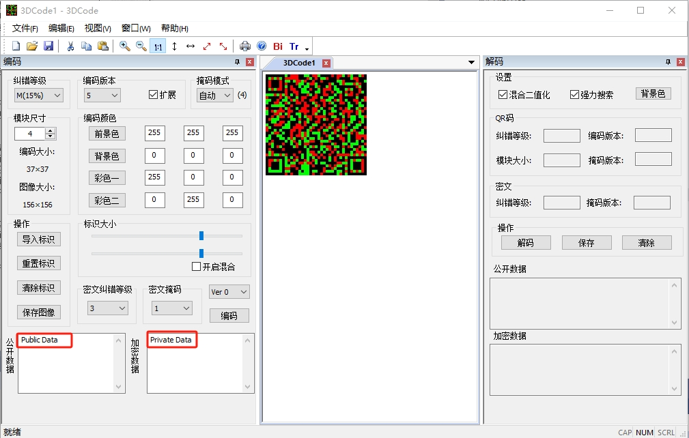
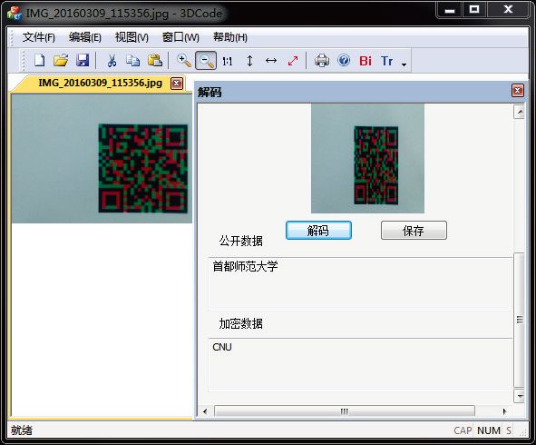

# 3DCode

## 简  介

一种基于QR二维码的彩色二维码编码译码设计及其软件实现。该彩色二维码提升了普通黑白二维码的防伪性能，并且编码量增大到1.5倍。
该软件是首都师范大学数学科学学院研究生毕业设计研究的课题，也是研究生创新创业项目所支持的内容之一。彩色QR码兼容QR码，
在QR码的图层上用色彩编码私有信息，借助于隐形光学材料，该QR码在肉眼下与普通二维码无异。目前，在4色模式下编码数据量将达到QR码的2倍。

## 摘  要

条码技术是一项新颖而充满生机活力的技术，二维码技术是条码技术新的发展方向与研究热点，是一项集信息编码、信息传递、图像处理、
数据加密等技术于一体的综合性技术。

QR码是一种矩阵形式二维条码，它由日本电装株式会社(DENSO CORPORATION)在1994年开发，并于2000年成为ISO国际标准。2001年，
QR码成为我国国家标准。随着智能手机的普及，QR码日益被大众所认知、接受，已广泛见于日常生活，而且作为一项新的防伪措施，
也已被广泛用在电子票务、物流溯源等方面。但QR码容易被复制，防伪易被攻破。

本文研究了一种基于QR码的彩色二维码编码译码设计及实现，并与上转换发光材料结合起来，建立起QR码的防伪双屏障。一方面是软件屏障，
不仅具有普通QR码的全部性能，还将色彩进行编码，使二维码携带更多的信息；另一方面是硬件屏障，化学材料不可复制。
两道屏障使彩色QR码防伪性能得到提高，兼具时尚性与技术性。彩色QR码可以部分甚至完全隐藏，在人眼观看只是普通的QR码，
用智能手机就能解析，得到基础信息。但用激光照射它会发出彩色光，经专有设备解码能获得双层信息，一是普通二维码信息，
比如商品的生产信息，二是特殊信息，比如鉴别商品真假的信息。本文利用到的主要技术是图像处理算法和RS纠错编码理论，
创新点是首次设计彩色QR码，并将化学材料与二维码结合起来用于防伪，这尚属首次。

本文前两章是知识储备。第一章介绍了条码技术和课题研究背景，第二章介绍了矩阵式QR码，并对QR码的编码解码过程进行了分析与研究。
第三至四章是对彩色二维码的设计与实现。第三章提出了一种简单可行的彩色QR码的编码解码设计方案。第四章介绍了在PC端和安卓平台
实现的彩色QR码编码解码程序。第五章介绍了作者基于QR码设计的隐形二维码与融合二维码，并对本文下了一个结论。

QR码虽然得到了广泛的运用，但因为是日本的专利技术，因此可能存在安全隐患。本文在后期仿照QR码的设计思路，自行设计了一套二维码
编码译码方法，并拟在这套技术之上研发彩色二维码。

**关键词**：QR码、二维码防伪、图像处理、编码解码、纠错编码

---

# A 3D colored QR code

## Encoding and decoding design and anti-counterfeiting application of a color QR code

## Abstract

The bar code technology is a novel technology full of vitality, of which the two-dimensional barcode technology is 
the recent development direction and the research hot spot. It is a comprehensive technology which combines information 
coding, information transmission, image processing, data encryption and so on.

The QR Code is one kind of matrix form 2D barcode which researched and developed in 1994 by Japanese Denso Corporation, 
and became the ISO international standards in 2000. In 2001, the QR Code became China's national standards. With the 
popularity of smart phones, QR Code is increasingly being recognized and accepted by the public, and has been widely 
seen in daily life. As a new anti-counterfeiting measure, QR Code has been widely used in electronic ticketing, 
logistics, traceability, etc. However, QR Code is easy to be copied, and its anti-counterfeiting is easy to be breached.

In this paper, we study the encoding and decoding method of a kind of colored 2D barcode which is based on QR Code, 
and combining with transformation on the luminescence materials, we establish a QR Code anti-counterfeiting double 
barrier. On the one hand is the software barrier, it not only has the ordinary QR Code complete performance, but also 
it encodes the colors, thus causes 2D barcode carry more information; On the other hand is the hardware barrier, 
chemical material cannot be duplicated. Two barriers enable the colored QR Code forgery-proof performance to obtain 
the enhancement, concurrently fashion and technical nature. The colored QR Code may be partly even completely hidden, 
in the human eye on looking is only the ordinary QR Code. Using mobile phones to decode, we get basic information. 
But with laser it will emit light color, the proprietary equipment is able to win a double information by decoding it, 
one is ordinary QR Code information, such as the production of commodity information, the second is special information, 
such as identify true or false information. The main technologies used by this article are the algorithm of image 
processing and the RS error correction coding theory, the innovation spot is that we design the colored QR Code for 
the first time, and unifies chemistry material and the 2D barcode uses in the forgery-proof, this still was for the first time.

The first two chapters of this article are the knowledge reserves. First chapter introduced the bar code technology 
and the topic research background. Second chapter introduced the matrix form QR Code, and the encoding and decoding 
process of QR Code is analyzed and studied. Third to fourth chapters showed the colored QR Code design and the realization. 
Third chapter proposed one kind of simple feasible colored QR Code encoding and decoding design proposal. Fourth chapter 
introduced the colored QR Code encoding and decoding procedures on the PC and the android platform. In the fifth chapter, 
we introduced the stealth 2D code and the fusion 2D code based on the design of QR Code, and finally we drawn a conclusion 
to this article.

QR Code has been widely used, but because it is Japan's patented technology, there may be a security risk. Late in imitates 
the QR Code design, this paper designed a set of 2D barcode encoding and decoding method, and on this technology 
research we will develop a new colored 2D barcode.

**Key words**: QR Code, 2D barcode anti-counterfeiting, image processing, encoding and decoding, error correction of coding
